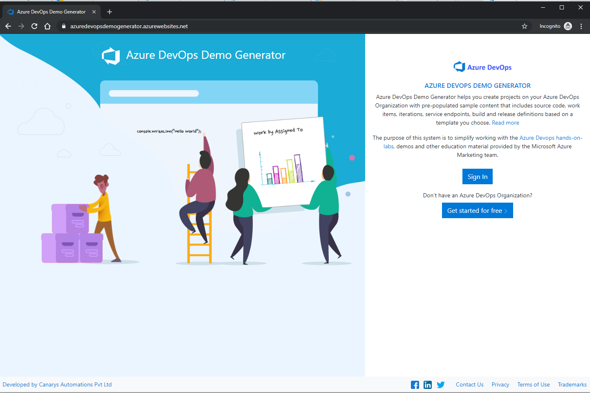

# Getting Started

Getting started with sfpowerscripts is easy.  The starter sample pipelines are available in GitHub Releases. They can be imported using Azure DevOps Demo Generator


If you are competent with Azure Pipelines, skip the below steps.   
Directly import the sample pipelines once the extension is installed or compose pipelines using the classic designer or yaml. 




1. Sign into your Azure Pipelines Account. If you do not have an azure pipelines account, it is quite easy to get one going. Follow the links [here](https://azure.microsoft.com/en-au/services/devops/) 
2. Install the sfpowerscripts extension into your Azure Pipelines org from [here](https://marketplace.visualstudio.com/items?itemName=AzlamSalam.sfpowerscripts) 
3.  Navigate to Azure DevOps Demo Generator at [https://azuredevopsdemogenerator.azurewebsites.net](https://azuredevopsdemogenerator.azurewebsites.net/)

  4. Select your organization

  5. Type in a project name for the "to-be" created project

    6. Click on choose template and then navigate to the private tab

    7. Choose Local Drive and use  the zip file downloaded from the url  [sfpowerscripts sample pipelines](https://github.com/Accenture/sfpowerscripts/releases/download/Release_15/sfpowerscripts_sample_pipelines.zip)

    8. Click on Create Project and wait for the project to be completed

    9.  Navigate to the newly created project in your Azure Pipelines Org

  10. Confirm the build and release pipelines are created. Now you may configure the tasks accordingly.

Head over to[ Task Specifications](task-specifications/) for details on configuring the task  

