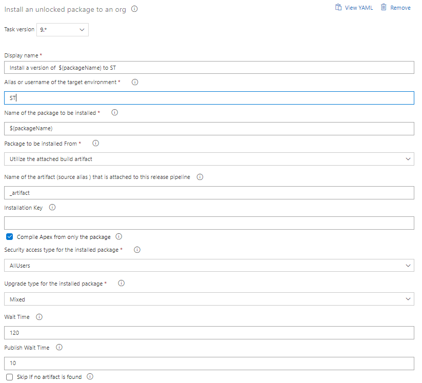

# Install an Unlocked Package to an org


| Task Id | Version |
| :--- | :--- |
| sfpwowerscript-installunlockedpackage-task | 11.0.5 |

  
****This task is a wrapper over `sfdx force:package:install` [command](https://developer.salesforce.com/docs/atlas.en-us.sfdx_cli_reference.meta/sfdx_cli_reference/cli_reference_force_package.htm) along with  function to deploy artifacts generated by [Create a new version of Unlocked Package](../packaging-tasks/create-a-new-version-of-unlocked-package.md) task, as well as by passing in the package Id. This task is meant to be used in Release Pipeline

**Prerequisites**

[Install SFDX CLI with sfpowerkit](../utility-tasks/install-sfdx-cli-with-sfpowerkit.md) must be added to the pipeline before utilizing this task

**Task Snapshot**



#### Parameters



Classic Designer Labels are in **Bold,**  YAML Variables are in _italics_

* **Alias or username of the target org /** _target\_org_

  Provide the alias or username of the target org  on which the unlocked package is to be deployed  
  __

* **Name of the package to be installed  /** _package_

  Name of the package to be installed  

* **Package to be installed From /** _packageinstalledfrom_  
  ****The provider for the particular artifact that is attached to the pipeline, The task supports these possible values

   - **From Artifact** / _Artifact_: If you want to use an artifact   
          - **Path to the directory where artifacts are downloaded /** artifactDir :  Provide the path of the directory where the artifacts will be unpacked, By default the task will pick up the Pipeline.Workspace \(in case of YAML Pipelines\) or System.ArtifactsDirectory \(in case of Classic Pipelines\). This is enabled only if _packageinstalledfrom_  is _Artifact_  
  -  **Custom** / Custom:  If  you want to pass in the package\_version\_id manually, such as using this task to install managed packages or a previously built package  
        - **Package Version Id /** _package\_version\_id:_  ****Only enabled if the above option \(Package to be installed from is Custom\), pass the  version id of the package  

* **Name of the artifact \(source alias \) that is attached to this release pipeline** / artifact ****The source alias of the artifact that is attached to this release pipeline. Please note it will only accept artifact generated by [Create SFDX Unlocked Package](../packaging-tasks/create-a-new-version-of-unlocked-package.md) 
* **Installation Key** _\(installationkey\)_

  Installation key for the package version to be installed  

* **Compile Apex from only the package /** _apexcompileonlypackage_

  Specifies whether to compile all Apex in the org and package, or only the Apex in the package.  

* **Security access type for the installed package /** _security\_type_

  Security access type for the installed package, Permissible values are:  
       -  **AllUsers /** _AllUsers : If the unlocked package is to be installed for all users_  
       - **AdminsOnly** / _AdminsOnly_: If the unlocked package is to be installed for admins only  

* **Upgrade type for the installed package /** _upgrade\_type_

  Upgrade type for the package to be installed, Permissible values are:   
   - **Mixed /** _Mixed_  
  -  **DeprecateOnly / DeprecateOnly**   
  -  **Delete /** _Delete_  
  
  From the CLI Help,  
  "For package upgrades, specifies whether to mark all removed components as deprecated \(DeprecateOnly\), to delete removed components that can be safely deleted and deprecate the others \(Mixed\), or to delete all removed components, except for custom objects and custom fields, that don't have dependencies \(Delete\). The default is Mixed. Can specify DeprecateOnly or Delete only for unlocked package upgrades."  
  

* **Wait Time** _/ wait\_time_

  Wait time for the command to finish in minutes  

* **Publish Wait Time /**  _publish\_wait\_time_

  Wait time for the command to wait for the created package to be available in the org, before it can be installed

* **Skip if the package is already installed in the org** / _skip\_if\_package\_installed_

  Skip installation of the package if it is already installed in the org  

* **Skip if no artifact is found** / skip\_on\_missing\_artifact Once enabled, the task will be skipped if the artifact mentioned is not attached to the release pipeline. This option is useful if the artifacts are attached to the release pipeline dynamically







```text
   - task: sfpwowerscript-installunlockedpackage-task@<version>
      displayName: Deploy <MyPackage> to <alias>
      inputs:
        target_org: <alias>
        package: <MyPackage>
        packageinstalledfrom: 'Artifact'
        package_version_id: $(CIPackageCreate.sfpowerscripts_package_version_id)
        security_type: 'AdminsOnly'
        upgrade_type: 'Mixed'

```



\*\*\*\*

**Changelog**

* 11.0.5 Refactor artifact structure [\#131](https://github.com/Accenture/sfpowerscripts/pull/131), remove artifact type and source alias input parameters [\#151](https://github.com/Accenture/sfpowerscripts/pull/151)
* 10.0.3 [\#98](https://github.com/Accenture/sfpowerscripts/pull/98) Skip installation if already installed
* 9.2.0
  * Removed Telemetry Collection
  * Added support for Azure Artifacts
  * Added support for skipping task if specified artifact is not found
* 8.0.9 Refactored to use revamped folder structure
* 7.0.4 Support for installation of packages of a build that generate multiple artifacts such as MonoRepo
* 6.0.0 Fix labels and help description
* 5.0.1 Updated with Telemetry
* 4.1.0 Initial Version

