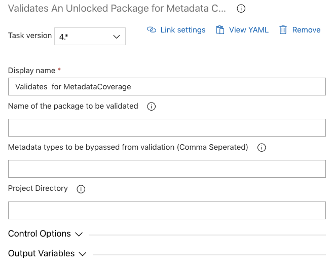

# Validate Unlocked Package for Metadata Coverage

| Task ID | Latest version |
| :--- | :--- |
| sfpwowerscript-validatedxunlockedpackage-task | 4.0.14 |

This task is used to validate the metadata coverage of components that are part of the unlocked package you are building. Typically there are components in normal development that are not covered by unlocked packaging such as settings. Having this metadata in your project directory results in either these metadata to be skipped or results in an error during the time of packaging. This task checks whether the analyzed  source directory has any metadata that is not covered by unlocked packaging.

**Prerequisites**

[Install SFDX CLI with sfpowerkit](../utility-tasks/install-sfdx-cli-with-sfpowerkit.md)  task must be added to the pipeline before utilizing this task

**Task Snapshot**



#### Parameters



Classic Designer Labels are in **Bold,**  YAML Variables are in _italics_

* **Name of the package to be validated /** _package_  
  The name of the package to be validated_._ If left empty, all of the packages in the project configuration will be validated.

* **Metadata types to be bypassed from validation /** _bypass_  
  Comma-separated list of metadata types to be excluded from metadata coverage validation

* **Project Directory** _**/**_  ****_working\_directory_ The project directory, containing the sfdx-project.json.



None



```text
steps:
- task: sfpwowerscript-validatedxunlockedpackage-task@<version>
  displayName: Validates [package] for MetadataCoverage
  inputs:
    package: [name]
    bypass: [metadata type]
    working_directory: [dir]
```



**Changelog**

* 4.0.8 Update Core dependency
* 4.0.4 Updated to remove telemetry collection
* 3.0.9 Refactored to use revamped folder structure
* 2.0.1 Updated with Telemetry
* 1.0.0 Updated for inclusion of bypass option from sfpowerkit

