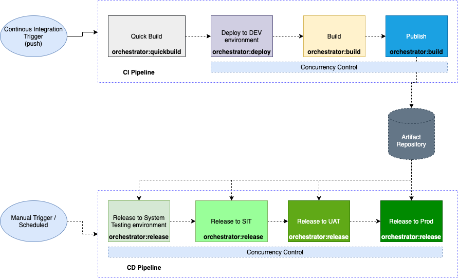

# Artifacts

## Artifacts

sfpowerscripts operate on the concepts of artifacts. Artifacts are central to the concept of sfpowerscripts and its very existence. Artifacts are traceable, versioned, immutable entities that get generated during the build or promote command. sfpowerscripts artifacts contain source code of the package, metadata information, changelog and much more. Artifacts help sfpowerscripts to orchestrate deployment without being tied to the notion of branches.

### Artifact Registries in the context of sfpowerscripts

Artifact registry allows you to split your CI and CD pipelines. We believe that this is essential for a smoother deployment model and allows you to better control what is being deployed to environments if you are using a **multi-speed deployment strategy.**



Let's have a look at the below example, here a CI pipeline creates a bunch of artifacts/packages, then the publish command is used to publish these artifacts into an Artifact Registry. This stage often gets repeated multiple times during a day.

An important thing to note here is especially when a CI pipeline is enabled with '[diffcheck](../commands/build-and-quickbuild.md#how-does-build-and-quickbuild-know-what-to-build-when-using-diffcheck-flag)**'** functionality, it only builds packages for the particular build run. Unless you are immediately deploying these packages to production, there is no way to deploy an entire set of packages other than going through each of the build runs and immediately pushing them into production. You will need to aggregate packages before you proceed to the next stage.

One approach to solve is to use branches, where a branch per environment is used to stage changes, and new builds are generated from this branch to deploy to the environment. We believe this practice is incorrect as they break the traceability chain and errors could be introduced, moreover it complicates your version control strategy. Our premise is rather to use the same set of artifacts that were built at one stage all the way to production.

This is where an artifact registry comes into play, it stores all the artifacts produced by the build stage into a repository, which allows you to consolidate all versions of your artifacts and then allowing you to decide which all packages/artifacts should be aggregated and released into production.

The CD pipeline \(or called as 'Release' pipelines in some CI/CD systems\) can be triggered manually or automatically, with artifacts and its version number/tag as the input, such as by using a release definition used by the [fetch](artifacts.md) command.

### **Type of Artifact Registries supported**

Rather than lock everyone into a particular registry provider, sfpowerscripts supports artifact registries which support the following:

* **NPM compatible private registry** \(Almost every artifact registries supports NPM \)
* **A registry that supports universal packages \(**JFrog Artifactory, Azure Artifacts\)


Please ensure you are not publishing sfpowerscripts artifacts to npm.js, \(the default public npm registry\). It is against the terms of service for npm.js, as it only allows JavaScript packages.


### Setting up an Artifact Registry

Please refer to your artifact registry provider's documentation on how to set it up. If you are planning to use npm compatible private registry, here are some links to get you started

* [Github](https://docs.github.com/en/packages/guides/configuring-npm-for-use-with-github-packages)
* [GitLab](https://docs.gitlab.com/ee/user/packages/npm_registry/)
* [Azure Artifacts](https://docs.microsoft.com/en-us/azure/devops/artifacts/get-started-npm?view=azure-devops%20)
* [JFrog Artifactory](https://www.jfrog.com/confluence/display/JFROG/npm+Registry)
* [MyGet](https://docs.myget.org/docs/reference/myget-npm-support)

### Publishing/Fetching Packages to or from Artifact Registry

sfpowerscripts provides with functionality to help you [fetch](artifacts.md) or [publish](../commands/publish.md) artifacts. Some orchestrator commands like [prepare](../commands/prepare.md) also fetches artifacts from the artifact registry.

