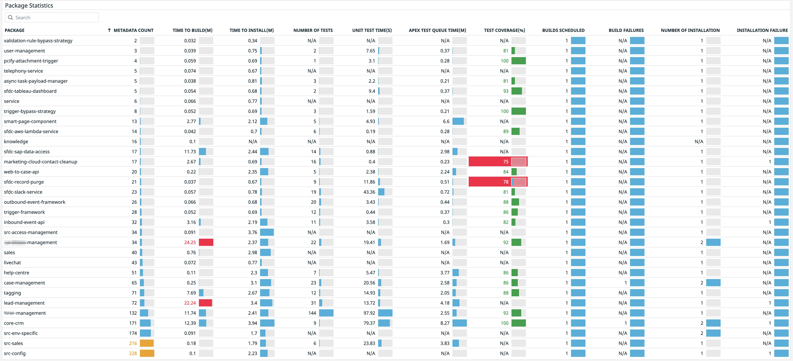

# Metrics and Dashboards

Metrics should be a key part of your DevOps process. It is through these metrics, one can drive continuous improvement of your delivery process. Almost all commands in sfpowerscripts, are instrumented with [StatsD](https://www.datadoghq.com/blog/statsd/) as well as Log Based Metrics.

## Getting started with Metrics

#### Stats D

* Ensure you have a StatsD Daemon running on a server, Setting up StatsD daemon on a server is quite simple, there are lot of guides available \([https://www.scalyr.com/blog/statsd-measure-anything-in-your-system/](https://www.scalyr.com/blog/statsd-measure-anything-in-your-system/)\) . If you are after a hosted StatsD, hosted Graphite offers a hosted StatsD solution as part of their Hosted Graphite offering \([https://www.hostedgraphite.com/docs/integrationguide/ig\_hosted\_statsd.html](https://www.hostedgraphite.com/docs/integrationguide/ig_hosted_statsd.html)\). 
* Ensure your build agents can reach the StatsD server, this can be bit problematic, when you are using cloud based agents, which imply StatsD service has to be on the internet and reachable from the agent, so plan this out.  If you are using self hosted agents, the StatsD server should be reachable as well.
* To visualize these metrics, you need a StatsD Backend \([https://thenewstack.io/collecting-metrics-using-statsd-a-standard-for-real-time-monitoring/](https://thenewstack.io/collecting-metrics-using-statsd-a-standard-for-real-time-monitoring/)\) such as DataDog \(Hosted\), Graphana, and many others to aggergate and report data.
* Enable StatsD metrics in your scripts by adding these environment variables

```text
 # Set STATSD Environment Variables for logging metrics about this build
 export SFPOWERSCRIPTS_STATSD=true
 export SFPOWERSCRIPTS_STATSD_HOST=172.23.95.52 
 export SFPOWERSCRIPTS_STATSD_PORT=8125     // Optional, defaults to 8125 
 export SFPOWERSCRIPTS_STATSD_PROTOCOL=UDP  // Optional, defualts to UDP, Supports UDP/TCP
```

#### Log Based Metrics

sfpowerscripts is also able to generate metrics in a log file.  These metrics are written to **.sfpowerscripts/metrics.log** in your working directory.  This log file after every run of a command could be send to a log aggregator for further analysis.  


 The JSON payload consist  of the the following, name of the metric \(**metric**\), type of the metric such as count, guage or timers  \( **type** \), timestamp \(**timestamp**\) and followed by tags pertaining to the particular metric \(**tags**\)  
  
A sample metric is shown below       

```text
{"metric":"sfpowerscripts.build.scheduled.packages","type":"count","timestamp":1616475396815,"tags":{"package":"core-crm","type":"Unlocked","is_diffcheck_enabled":"true","is_dependency_validated":"true","pr_mode":"false"}
```

One could write a parse this file, and then send each individual entries to a  logging system that allows JSON based logging.

## Metrics available within sfpowerscripts

The following are the list of metrics that are captured.

| METRIC | DESCRIPTION | TYPE |
| :--- | :--- | :--- |
| sfpowerscripts.deploy.failed | Number of times deploy command failed | COUNT |
| sfpowerscripts.deploy.duration | Time spent on executing deploy command | GUAGE |
| sfpowerscripts.deploy.scheduled | Number of times deployment was scheduled to run | COUNT |
| sfpowerscripts.deploy.scheduled.packages | Number of packages that were scheduled to be deployed by the deploy command | GUAGE |
| sfpowerscripts.deploy.succeeded | Number of succeeded deploy executions | COUNT |
| sfpowerscripts.deploy.succeeded.packages | Number of packages that were successfully deployed | GUAGE |
| sfpowerscripts.deploy.failed | Number of times deploy command failed to execute | COUNT |
| sfpowerscripts.deploy.failed.packages | Number and details of packages that failed to deploy | GUAGE |
| sfpowerscripts.build.scheduled | Number of times build was scheduled to run | COUNT |
| sfpowerscripts.build.duration | Time spent on executing build command | GUAGE |
| sfpowerscripts.build.scheduled.packages | Number of packages being scheduled to build | GUAGE |
| sfpowerscripts.build.succeeded.packages | Number of packages successfully built | GUAGE |
| sfpowerscripts.build.failed.packages | Number of packages failed to build | GUAGE |
| sfpowerscripts.validate.failed | Number of time validate failed to execute | COUNT |
| sfpowerscripts.validate.duration | Time spent on executing validate command | GUAGE |
| sfpowerscripts.publish.duration | Time spent on executing publish command | GUAGE |
| sfpowerscripts.publish.succeeded | Number of succeeded publish executions | COUNT |
| sfpowerscripts.package.installation | Number of times a package was installed | COUNT |
| sfpowerscripts.package.installation.elapsed\_time | Time taken to install a package | GUAGE |
| sfpowerscripts.package.elapsed | Time taken to create a package | GUAGE |
| sfpowerscripts.package.created | Number of times a particular package was created | COUNT |
| sfpowerscripts.package.metadatacount | Number of metadata in a package | GUAGE |
| sfpowerscripts.package.testcoverage | Test Coverage of a package | GUAGE |
| sfpowerscripts.apextests.triggered | Number of times apex tests were triggered for a package | COUNT |
| sfpowerscripts.apextest.testtotal | Time taken for Apex Test Execution | GUAGE |
| sfpowerscripts.apextest.command.time | Time taken for Apex Test  Execution \(Command Time\) | GUAGE |
| sfpowerscripts.prepare.succeededorgs | Number of orgs that were succeeded during a run of prepare | GUAGE |
| sfpowerscripts.prepare.failedorgs | Number of orgs that failed during a run of prepare | GUAGE |
| sfpowerscripts.prepare.duration | Time take to prepare a  pool of scratchorgs | GUAGE |
| sfpowerscripts.pool.remaining | Number of scratch orgs that are remaining in a pool after fetched by validate command | GUAGE |

## Sample Dashboards




